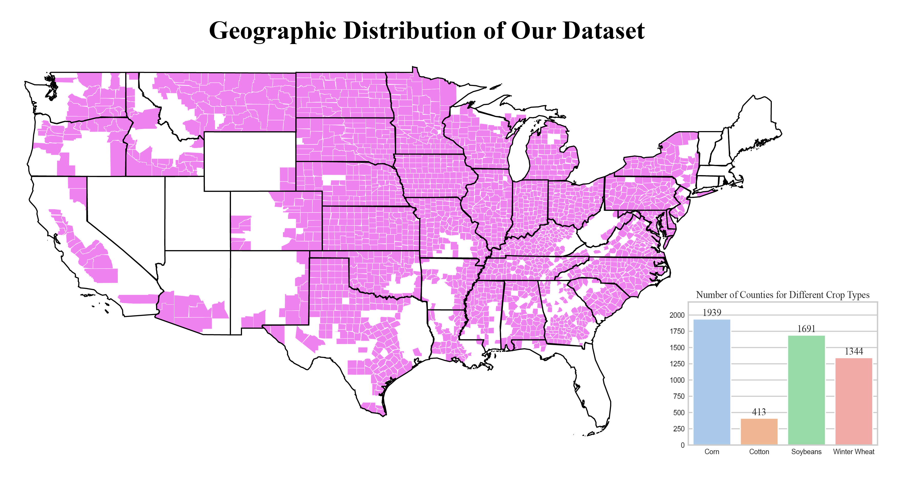

# CropNet: An Open Large-Scale Dataset with Multiple Modalities for Climate Change-aware Crop Yield Predictions

Precise crop yield predictions are of national importance for ensuring food security and sustainable agricultural practices. While AI-for-science approaches have exhibited promising achievements in solving many scientific applications such as drug discovery, precipitation nowcasting, etc., the development of deep learning models for predicting crop yields is constantly hindered by the lack of an open and large-scale deep learning-ready dataset with multiple modalities having sufficient information. To remediate this, we aim to introduce the CropNet dataset, the first terabyte-sized, publicly available, and multi-modal dataset specifically targeting crop yield predictions for the contiguous United States (U.S.) continent at the county level. Our CropNet dataset is composed of three modalities of data, i.e., Sentinel-2 Imagery, WRF-HRRR Computed Dataset, and USDA Crop Dataset, for over 2200 U.S. counties spanning 6 years (2017-2022). Specifically, Sentinel-2 Imagery is obtained from the Sentinel-2 mission for precisely monitoring and relating crop growth. WRF-HRRR Computed Dataset, sourced from the Weather Research & Forecasting-based High-Resolution Rapid Refresh (WRF-HRRR) model, covers daily and monthly weather conditions, accounting respectively for growing season weather variations and climate change. USDA Crop Dataset, collected from the USDA Quick Statistic website, provides annual crop information for major crops grown in the U.S. Our CropNet is expected to facilitate researchers in developing versatile deep models for timely and precisely predicting crop yields at the county level, by accounting for the effects of both short-term growing season weather variations and long-term climate change on crop yields. We have conducted extensive experiments using our CropNet dataset, by employing a convolutional LSTM-based model and a Vision Transformer (ViT)-based model. The results validate the applicability of the CropNet dataset under different deep learning models and its efficacy in climate change-aware crop yield predictions.

## Overview

0ur dataset is composed of three modalities of data, i.e., Sentinel-2 Imagery, WRF-HRRR Computed Dataset, and USDA Crop Dataset, spanning from 2017 to 2022 (i.e., 6 years) across 2291 U.S. counties, with its geographic distribution illustrated below. We also include the number of counties corresponding to each crop type in the USDA Crop Dataset (see the rightmost bar chart in the figure) since crop planting is highly geography-dependent.

