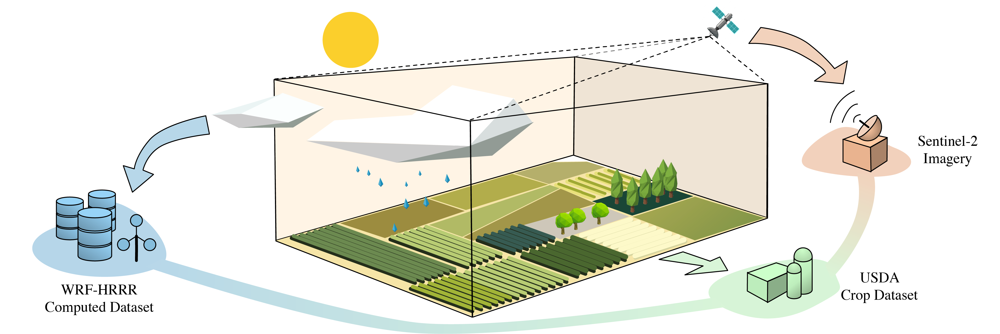
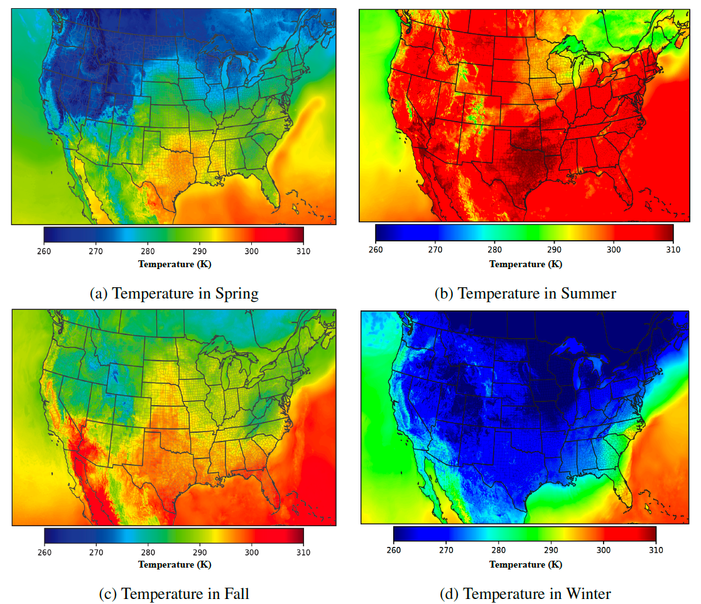
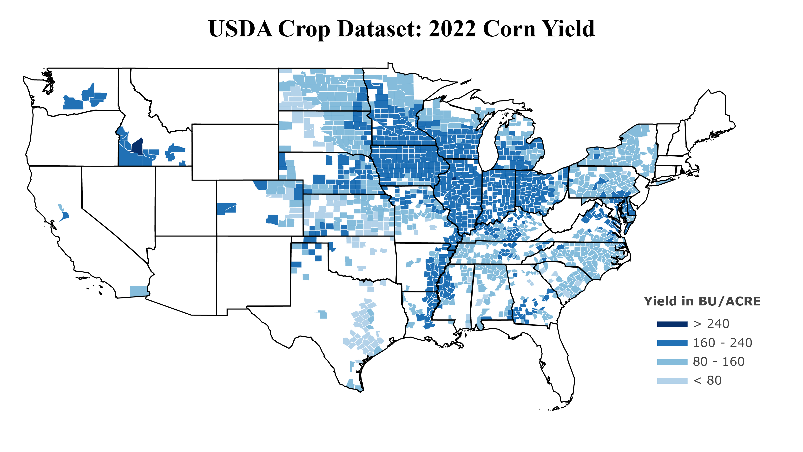

# CropNet: An Open Large-Scale Dataset with Multiple Modalities for Climate Change-aware Crop Yield Predictions




The CropNet dataset is an open, large-scale, and deep learning-ready dataset, specifically targeting climate change-aware crop yield predictions for the contiguous United States (U.S.) continent at the county level. It is composed of three modalities of data, i.e., Sentinel-2 Imagery, WRF-HRRR Computed Dataset, and USDA Crop Dataset, aligned in both the spatial and temporal domains, for over 2200 U.S. counties spanning 6 years (2017-2022). It is expected to facilitate researchers in developing deep learning models for timely and precisely predicting crop yields at the county level, by accounting for the effects of both short-term growing season weather variations and long-term climate change on crop yields.


## Contribution

#### The `CropNet` dataset

- The first *terabyte-sized*, publicly available, and multi-modal dataset for climate change-aware crop yield predictions
- The `CropNet` dataset is available at [Google Drive](https://drive.google.com/drive/folders/1Js98GAxf1LeAUTxP1JMZZIrKvyJStDgz)

#### The `CropNet` package 

- A *deep learning-ready* Python package for facilitating researchers in developing deep neural networks (DNNs) for climate change-aware crop yield predictions
- The `CropNet` package is available at [Python Package Index (PyPI)](https://pypi.org/project/cropnet/)


## Tutorial

The tutorials for the CropNet dataset are available at Google Colab, with their links listed below

- [Sentinel-2 Imagery Tutorial](https://colab.research.google.com/drive/1Tj69JdhO7aX8ks-4UWYvHrFm9GB1PNCd?usp=sharing)
- [WRF-HRRR Computed Dataset Tutorial](https://colab.research.google.com/drive/14l-JSNHtelawNu3kVG_ukTd2WUJpaZEc?usp=sharing)

- [USDA Crop Dataset Tutorial](https://colab.research.google.com/drive/1U-vFoRyLSb2l2Q67LeGbkUKTeRaHDkkK?usp=sharing)


## The CropNet Dataset

0ur CropNet dataset is composed of three modalities of data, i.e., Sentinel-2 Imagery, WRF-HRRR Computed Dataset, and USDA Crop Dataset, spanning from 2017 to 2022 (i.e., 6 years) across 2291 U.S. counties, with its geographic distribution illustrated below. We also include the number of counties corresponding to each crop type in the USDA Crop Dataset (see the rightmost bar chart in the figure) since crop planting is highly geography-dependent.


### Sentinel-2 Imagery

The Sentinel-2 Imagery, obtained from the Sentinel-2 mission, provides high-resolution satellite images for monitoring crop growth on the ground. It contains two types of 224x224 RGB satellite images, agriculture imagery (AG) and normalized difference vegetation index (NDVI), both with a spatial resolution of 9x9 km, and a revisit frequency of 14 days. Examples of AG and NDVI images are depicted as follows.

- **Agriculture Imagery (AG)**


- **Normalized Difference Vegetation Index (NDVI)**


### WRF-HRRR Computed Dataset

The WRF-HRRR Computed Dataset, sourced from the WRF-HRRR model, contains daily and monthly meteorological parameters, with the former and the latter designed for capturing direct effects of short-term growing season weather variations on crop growth, and for learning indirect impacts of long-term climate change on crop yields, respectively. It contains 9 meteorological parameters gridded at 9 km in a one-day (and one-month) interval. The figures show the temperature in Spring, Summer, Fall, and Winter, respectively.




### USDA Crop Dataset

The USDA Crop Dataset, collected from the USDA Quick Statistic website, offers valuable information, such as production, yield, etc., for crops grown at each available county. It offers crop information for four types of crops, i.e., corn, cotton, soybeans, and winter wheat,  at a county-level basis, with a temporal resolution of one year. The figure illustrates the 2022 Corn Yield across the United States.




Although our initial goal of crafting the CropNet dataset is for precise crop yield prediction, we believe its future applicability is broad and can benefit the deep learning, agriculture, and meteorology communities, for exploring more interesting, critical, and climate change-related applications, by using one or more modalities of data.


### The CropNet Package

Beyond the contribution of our CropNet dataset, we also release the CropNet package in the [Python Package Index (PyPI)](https://pypi.org/project/cropnet/) for facilitating researchers in downloading the CropNet data on the fly over the time and region of interest, and flexibly building their deep learning models for accurate crop yield predictions. In particular, the CropNet package includes three types of APIs, listed as follows:

- **DataDownloader**: This API allows users to download the CropNet data over the time/region of interest on the fly.
- **DataRetriever**: With this API, users can conveniently obtain the CropNet data stored in the local machine (e.g., if you have downloaded our curated CropNet from the [Google Drive](https://drive.google.com/drive/u/2/folders/1Js98GAxf1LeAUTxP1JMZZIrKvyJStDgz)) over the time/region of interest.
- **DataLoader**: This API is designed to facilitate users in developing their DNNs for crop yield predictions.


### Installation

Researchers and practitioners can install the latest version of CropNet with the following commands:

```python
# Create and activate a conda environment
conda create -n cropnet_api python=3.10
conda activate cropnet_api

# Install the latest version of CropNet
pip install cropnet

# Slove the ecCodes library dependency issue
pip install ecmwflibs
```


### CropNet API Examples

- **Example 1: A DataDownloader Example for Downloading the Up-to-date CropNet Data**

  Given the time and region (i.e., the FIPS codes for two U.S. counties) of interest, the following code presents how to utilize the **DataDownloader** to download the up-to-date CropNet data:

```python
from cropnet.data_downloader import DataDownloader

# Use the "target_dir" to specify where the data should be downloaded to
downloader = DataDownloader(target_dir="./data")

# Download 2022 USDA Soybean data
# Note that most of the 2023 USDA data are not yet available
downloader.download_USDA("Soybean", fips_codes=["10003", "22007"], years=["2022"])

# Download the 2023 (the 1st and 2nd quarters) Sentinel-2 Imagery
downloader.download_Sentinel2(fips_codes=["10003", "22007"], years=["2023"], image_type="AG")

# Download the 2023 (January to July) WRF-HRRR data
downloader.download_HRRR(fips_codes=["10003", "22007"], years=["2023"])
```


- **Example 2: A DataRetriever Example for Obtaining Our Curated CropNet Data**

  Given the time and region of interest, the following code shows how to use the **DataRetriever** to obtain the CropNet data stored in the local machine in a user-friendly format:

```python
# Use the "base_fir" to specify where the CropNet data is stored
retriever = DataRetriever(base_dir="/mnt/data/CropNet")
   
# Retrieve the 2022 USDA Soybean data
usda_data = retriever.retrieve_USDA(crop_type="Soybean", fips_codes=["10003", "22007"], years=["2022"])
   
# Retrieve the 2022 Sentinel-2 Imagery data
sentinel2_data = retriever.retrieve_Sentinel2(fips_codes=["10003", "22007"], years=["2022"], image_type="AG")
   
# Retrieve the 2022 WRF-HRRR data
hrrr_data = retriever.retrieve_HRRR(fips_codes=["10003","22007"], years=["2022"])
```


- **Example 3: A PyTorch Example for Using the DataLoader API for Training DNNs** 

The following code presents a PyTorch example of training a deep learning model for climate change-aware crop yield predictions, by utilizing the DataLoader  APIs:

```python
import torch
from torch.utils.data import DataLoader
from models_mmst_vit import MMST_ViT
from cropnet.dataset.hrrr_computed_dataset import HRRRComputedDataset
from cropnet.dataset.sentinel2_imagery import Sentinel2Imagery
from cropnet.dataset.usda_crop_dataset import USDACropDataset

# The base directory for the CropNet dataset
base_dir = "/mnt/data/CropNet"
# The JSON configuration file
config_file = "data/soybeans_train.json"

# The dataloaders for each modality of data
sentinel2_loader = DataLoader(Sentinel2Imagery(base_dir, config_file), batch_size=1)
hrrr_loader = DataLoader(HRRRComputedDataset(base_dir, config_file), batch_size=1)
usda_loader = DataLoader(USDACropDataset(base_dir, config_file), batch_size=1)

# The model, the optimizer, and the loss function
model = MMST_ViT()
optimizer = torch.optim.AdamW(model.parameters(), lr=1e-3, betas=(0.9, 0.999))
criterion = torch.nn.MSELoss()

# Traning the model for one epoch
for s, h, u in zip(sentinel2_loader, hrrr_loader, usda_loader):
    # x: satellite images
    # ys (or yl): short-term daily (or long-term monthly) weather parameters
    # z: ground-truth crop yield (or production) information
    x, ys, yl, z, = s[0], h[0], h[1], u[0]
    
    optimizer.zero_grad()
    z_hat = model(x, ys, yl)
    loss = criterion(z, z_hat)

    loss.backward()
    optimizer.step()
```


## License

CropNet has a [Creative Commons Attribution-NonCommercial 4.0 International (CC BY-NC 4.0)](https://creativecommons.org/licenses/by-nc/4.0/) license.