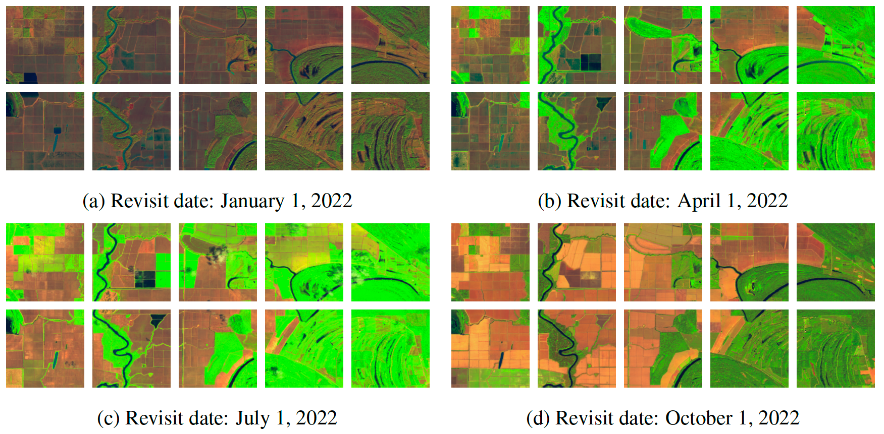

# CropNet: An Open Large-Scale Dataset with Multiple Modalities for Climate Change-aware Crop Yield Predictions


The CropNet dataset is an open, large-scale, and deep learning-ready dataset, specifically targeting climate change-aware crop yield predictions for the contiguous United States (U.S.) continent at the county level. It is composed of three modalities of data, i.e., Sentinel-2 Imagery, WRF-HRRR Computed Dataset, and USDA Crop Dataset, aligned in both the spatial and temporal domains, for over 2200 U.S. counties spanning 6 years (2017-2022). It is expected to facilitate researchers in developing deep learning models for timely and precisely predicting crop yields at the county level, by accounting for the effects of both short-term growing season weather variations and long-term climate change on crop yields.


## Overview

#### The `CropNet` dataset

- The first *terabyte-sized*, publicly available, and multi-modal dataset for climate change-aware crop yield predictions
- The `CropNet` dataset is available at [Google Drive](https://drive.google.com/drive/folders/1Js98GAxf1LeAUTxP1JMZZIrKvyJStDgz)

#### The `CropNet` package 

- A *deep learning-ready* Python package for training deep neural networks (DNNs) by using the `CropNet` dataset
- The `CropNet` package is available at [The Python Package Index (PyPI)](https://pypi.org/project/cropnet/)


## Tutorial

The tutorials for the CropNet dataset are avaiable at Google Colab, with their links listed below

- [USDA Crop Dataset Tutorial](https://colab.research.google.com/drive/1U-vFoRyLSb2l2Q67LeGbkUKTeRaHDkkK?usp=sharing)


## The CropNet Dataset

0ur CropNet dataset is composed of three modalities of data, i.e., Sentinel-2 Imagery, WRF-HRRR Computed Dataset, and USDA Crop Dataset, spanning from 2017 to 2022 (i.e., 6 years) across 2291 U.S. counties, with its geographic distribution illustrated below. We also include the number of counties corresponding to each crop type in the USDA Crop Dataset (see the rightmost bar chart in the figure) since crop planting is highly geography-dependent.


### Sentinel-2 Imagery

The Sentinel-2 Imagery, obtained from the Sentinel-2 mission, provides high-resolution satellite images for monitoring crop growth on the ground. It contains 224x224 RGB satellite images, with a spatial resolution of 9x9 km, and a revisit frequency of 14 days. The figures depict satellite images from the Sentinel-2 Imagery under four different revisit dates.




### WRF-HRRR Computed Dataset

The WRF-HRRR Computed Dataset, sourced from the WRF-HRRR model, contains daily and monthly meteorological parameters, with the former and the latter designed for capturing direct effects of short-term growing season weather variations on crop growth, and for learning indirect impacts of long-term climate change on crop yields, respectively. It contains 9 meteorological parameters gridded at 9 km in a one-day (and one-month) interval. The figures show the temperature in Spring, Summer, Fall, and Winter, respectively.


### USDA Crop Dataset

The USDA Crop Dataset, collected from the USDA Quick Statistic website, offers valuable information, such as production, yield, etc., for crops grown at each available county. It offers crop information for four types of crops, i.e., corn, cotton, soybeans, and winter wheat,  at a county-level basis, with a temporal resolution of one year. The figure illustrates the 2022 Corn Yield across the United States.


Although our initial goal of crafting the CropNet dataset is for precise crop yield prediction, we believe its future applicability is broad and can benefit the deep learning, agriculture, and meteorology communities, for exploring more interesting, critical, and climate change-related applications, by using one or more modalities of data.


### The CropNet Package

The code in the `CropNet` package

1. combines all three modalities of data to create $(\mathbf{x}, \mathbf{y_{s}}, \mathbf{y_{l}}, \mathbf{z})$ tuples, with $\mathbf{x}, \mathbf{y_{s}}, \mathbf{y_{l}}, \text{and}~ \mathbf{z}$ representing satellite images, short-term daily whether parameters, long-term monthly meteorological parameters, and ground-truth crop yield (or production) information, respectively, and
2. exposes those tuples via a `Dataset` object.

Notably, one or more modalities of data can be used for specific deep learning tasks. For example,

1. satellite images can be solely utilized for pre-training deep neural networks in a self-supervised learning manner (e.g., [SimCLR](https://arxiv.org/pdf/2002.05709.pdf), [MAE](https://arxiv.org/pdf/2111.06377.pdf), etc.), or
2. a pair of $(\mathbf{x}, \mathbf{y_{s}})$ under the same 9x9 km grid can be used for exploring the local weather effect on crop growth.


### Installation

- MacOS and Linux users can install the latest version of CropNet with the following command:

```sh
pip install cropnet
```

- Other users can directly utilize the `dataset` package in this repository

  

### A PyTorch Example

The following code presents a PyTorch example of training a deep learning model for climate change-aware crop yield predictions, by using the CropNet dataset and package:

```python
import torch
from torch.utils.data import DataLoader
from models_mmst_vit import MMST_ViT
from cropnet.dataset.hrrr_computed_dataset import HRRRComputedDataset
from cropnet.dataset.sentinel2_imagery import Sentinel2Imagery
from cropnet.dataset.usda_crop_dataset import USDACropDataset

# The base directory for the CropNet dataset
base_dir = "/mnt/data/CropNet"
# The JSON configuration file
config_file = "data/soybeans_train.json"

# The dataloaders for each modality of data
sentinel2_loader = DataLoader(Sentinel2Imagery(base_dir, config_file), batch_size=1)
hrrr_loader = DataLoader(HRRRComputedDataset(base_dir, config_file), batch_size=1)
usda_loader = DataLoader(USDACropDataset(base_dir, config_file), batch_size=1)

# The model, the optimizer, and the loss function
model = MMST_ViT()
optimizer = torch.optim.AdamW(model.parameters(), lr=1e-3, betas=(0.9, 0.999))
criterion = torch.nn.MSELoss()

# Traning the model for one epoch
for s, h, u in zip(sentinel2_loader, hrrr_loader, usda_loader):
    # x: satellite images
    # ys (or yl): short-term daily (or long-term monthly) weather parameters
    # z: ground-truth crop yield (or production) information
    x, ys, yl, z, = s[0], h[0], h[1], u[0]
    
    optimizer.zero_grad()
    z_hat = model(x, ys, yl)
    loss = criterion(z, z_hat)

    loss.backward()
    optimizer.step()
```


## License

CropNet has a [Creative Commons Attribution-NonCommercial 4.0 International (CC BY-NC 4.0)](https://creativecommons.org/licenses/by-nc/4.0/) license.